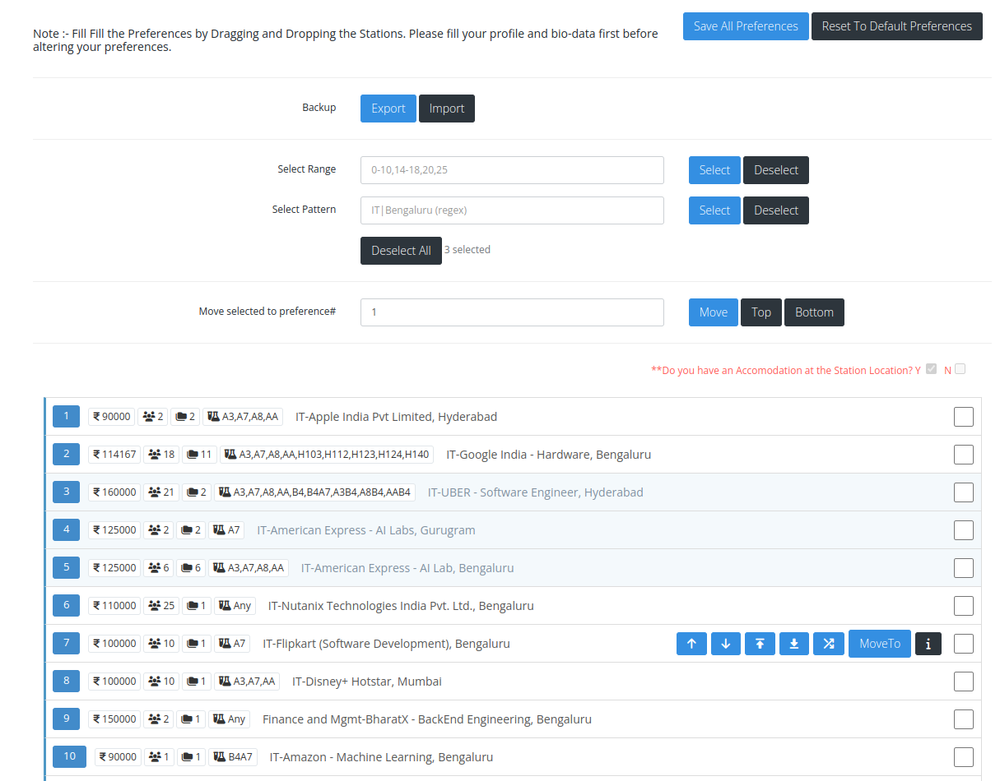

    
      
    <h1><code>PSD Extender</code></h1>
    <h4>Extends functionality of PSD interface.</h4>

## Features

👉 Adds controls for swapping PS station

👉 Select and move multiple stations

👉 Adds button to view problem bank, which automatically adds all relevent information to the row

👉 Backup your preferences

👉 Add notes

👉 Alert new stations added since last visit

👉 Removes the default jQuery implementation on the website

## 🎓 Usage

~~The easiest way to use this is to install is using webstore [here](http://bit.ly/ps-extender). For some reason, if you want to set it up manually:~~
This extension is not available on the Chrome Web Store presently. You can install it manually by following the steps below:

### Installing in Chrome

1. Download the latest version of `PSExtender.zip` from Releases -> [latest_chrome](https://github.com/Akshat-Oke/ps-extender/tags)
1. Unzip this folder
1. Type [`chrome://extensions/`](chrome://extensions/) in your URL
1. Enable Developer Mode (top-right)
1. Click on "Load unpacked"
1. Locate the extracted folder
1. Visit/Refresh your PSD page and click on the extension icon in your toolbar
1. You should now see an interface with the controls

### [Installing in Firefox](https://developer.mozilla.org/en-US/docs/Mozilla/Add-ons/WebExtensions/Your_first_WebExtension#installing)

1. Download the latest version from Releases -> [latest_firefox](https://github.com/Akshat-Oke/ps-extender/tags)
2. Enter the URL `about:debugging` in the address bar and click the `This Firefox` option to the left.
3. Click the `Load Temporary Add-on` button, then select any file in your extension's directory.

The extension now installs, and remains installed until you restart Firefox.

## Setup

- run `npm install` to install dependencies
- uses Vite in library mode to bundle extension
- `public/` + compiled source code is output to `dist/` folder
- run `npm run build` to build once. refresh browser and rerun extension.
- run `npm run build:watch` to watch for changes and build automatically. refresh and rerun.
- run `npm run dev` to test the extension on a local copy of the page (no need to install the extension). Auto-reloads
- run `npm run build:chrome` to build for chrome (in `dist` folder)
- run `npm run build:firefox` to build for firefox (in `dist` folder)
- run `npm run start:firefox` to build and run the extension in firefox (using `web-ext`)

## 🚀 Contributing

PRs are welcome and in fact, appreciated :)

- Check open Issues and PRs before you start
- Try to take up each issue in a separate PR
